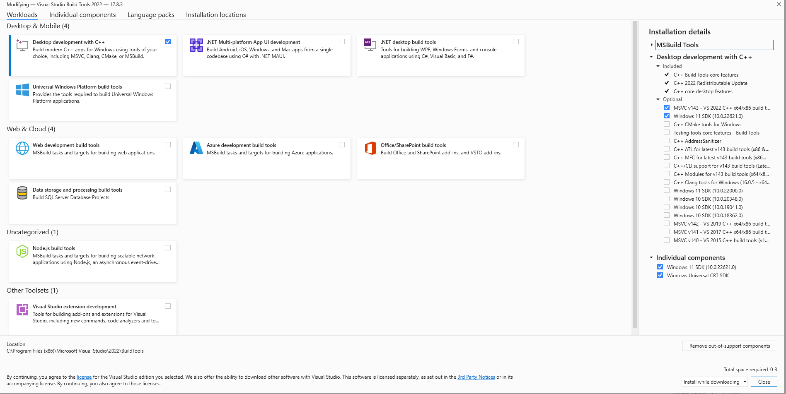

# orekit-pip

This is an attempt at providing the [Orekit Python Wrapper](https://gitlab.orekit.org/orekit-labs/python-wrapper/-/wikis/home) on PyPi.

## Requirements

* A C++ compiler
    * For Windows, see below
    * For Linux, this is gcc and g++
* `pip`

### Windows

* Install the Visual C++ build tools, version 14.0 or greater: https://visualstudio.microsoft.com/visual-cpp-build-tools/
* Additionally, install the two following modules as shown in the screenshot below:
    * Windows 11 SDK (or Windows 10 SDK if you're using Windows 10)
    * Windows Universal CRT SDK

## Installation

This can take a couple of minutes because it single-threadingly compiles the Orekit C++ bindings.

* `pip install git+https://github.com/GorgiAstro/orekit-pip.git`

Local installation:
* git clone this repo
* `pip install .`.

## Testing

`python test/orekit-hello-world.py`

## Code generation

This doesn't need to be done by the normal user, it is mostly done by the package publishers when a new version of Orekit is available for example.

This does the following:

* Copies the Orekit JARs and some Python additions (from https://github.com/petrushy/orekit_python_artifacts) to the `build/orekit` folder
* Calls `jcc` to generate Orekit's C++ bindings in the `build/_orekit` folder
    * `jcc` also generates the `setup.py` script which configures the compilation of the Orekit C++ extension. This script will then be called by `setuptools` (together with the definitions in `pyproject.toml`) when running `pip install`

To do that:

* `pip install -r requirements-generate.txt`
* `python generate.py`
* Clean up the generated `setup.py` file with a git diff tool (this is still a manual step):
  * If the `package_data` and `sources` lines changed, accept these changes
  * Otherwise, discard all the other changes to this file: the include paths and the link and compile arguments are managed by `jcc`

## Limitations

* The `org.orekit.compiler.plugin.DefaultDataContextPlugin` class is excluded, because it requires `JAVA_HOME/../lib/tools.jar`, which is not always available. But this plugin should not be needed by Orekit Python users: https://www.orekit.org/site-orekit-development/apidocs/org/orekit/compiler/plugin/DefaultDataContextPlugin.html
